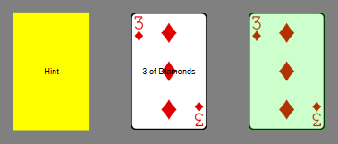

<!-- KDoc -->
[SingleLayerVisualKDoc]: https://tudo-aqua.github.io/bgw/concepts/visual/visual.html#singlelayervisual
[ColorVisualKDoc]: https://tudo-aqua.github.io/bgw/kotlin-docs/bgw-core/tools.aqua.bgw.visual/-color-visual/
[ImageVisualKDoc]: https://tudo-aqua.github.io/bgw/kotlin-docs/bgw-core/tools.aqua.bgw.visual/-image-visual/
[TextVisualKDoc]: https://tudo-aqua.github.io/bgw/kotlin-docs/bgw-core/tools.aqua.bgw.visual/-text-visual/
[CompoundVisualKDoc]: https://tudo-aqua.github.io/bgw/concepts/visual/visual.html#compoundvisual

[FontKDoc]: https://tudo-aqua.github.io/bgw/kotlin-docs/bgw-core/tools.aqua.bgw.util/-font/

<!-- Links -->
[FileDoc]: https://docs.oracle.com/en/java/javase/11/docs/api/java.base/java/io/File.html
[ColorDoc]: https://docs.oracle.com/en/java/javase/11/docs/api/java.desktop/java/awt/Color.html
[BufferedImageDoc]: https://docs.oracle.com/en/java/javase/11/docs/api/java.desktop/java/awt/image/BufferedImage.html

<!-- Start Page -->
# Visual

{: .no_toc}
<details open markdown="block">
  <summary>
    Table of contents
  </summary>
  {: .text-delta }
1. TOC
{:toc}
</details>

In this section we are going to showcase the different types of visuals in the BGW framework. Visuals are used to style
game elements in the application. Fundamentally there are two types of Visuals:

* [SingleLayerVisual][SingleLayerVisualKDoc]
* [CompoundVisual][CompoundVisualKDoc]

## [SingleLayerVisual][SingleLayerVisualKDoc]

A simple visual displaying its type of visualization.

### [ColorVisual][ColorVisualKDoc]

The [ColorVisual][ColorVisualKDoc] displays a solid Color. It can either be created with RGB / RGBA values or
via [java.awt.Color][ColorDoc]. Additionally,
it declares static fields for various standard colors. The following statements result in the same *red* visual:

````kotlin
val visual1: ColorVisual = ColorVisual(255, 0, 0)
val visual2: ColorVisual = ColorVisual(java.awt.Color(255, 0, 0))
val visual3: ColorVisual = ColorVisual(java.awt.Color.RED)
val visual4: ColorVisual = ColorVisual.RED
````

### [TextVisual][TextVisualKDoc]

The [TextVisual][TextVisualKDoc] displays one line of text. It can be created with the text to display as a string and an
optional [Font][FontKDoc]. The following example shows the code for a
TextVisual that displays "Token" in white with bold text in Arial 18px size. All parameters in the font constructor are
optional, so *fontStyle* for example is redundant as it contains the default value:
````kotlin
val visual: TextVisual = TextVisual("Token", Font(
  size = 18,
  color = Color.WHITE,
  family = "Arial",
  fontWeight = Font.FontWeight.BOLD,
  fontStyle = Font.FontStyle.NORMAL
))
````

### [ImageVisual][ImageVisualKDoc]

The [ImageVisual][ImageVisualKDoc] displays a given image. It can either be created with
a [BufferedImage][BufferedImageDoc] or
by declaring the image file to load
as [File][FileDoc] or path string relative to the
application's resource folder. Additionally, the size and position of a sub-image can be passed in order to select from
a texture map. The following code example shows how to load an image:

````kotlin
val visual: ImageVisual = ImageVisual("card_deck.png")
````


To select for example the **three of diamonds** from this texture map as a sub image, knowing that each card has a
height of 200px and width 130px, the following code can extract the card:

````kotlin
val visual: ImageVisual = ImageVisual(
  path = "card_deck.png",
  width = 130,
  height = 200,
  offsetX = 2 * 130,
  offsetY = 200
)
````

The full example can be found here: [View it on GitHub](https://github.com/tudo-aqua/bgw/blob/main/bgw-docs-examples/src/main/kotlin/examples/concepts/visuals/VisualsExample.kt){:
.btn }

## [CompoundVisual][CompoundVisualKDoc]
[CompoundVisuals][CompoundVisualKDoc] can be used to stack multiple visuals. Therefore, if
stacking [ColorVisuals][ColorVisualKDoc]
and [ImageVisuals][ImageVisualKDoc] they have to be partially transparent
in order to see the Visual beyond. The Visuals get added in the order they got passed from bottom to top.
CompoundVisuals can for example be used to create a Text with background Color (left), label a GameToken (center), or
display valid drop targets (right):



The right Visual for example has been created by the following code:

````kotlin
visual = CompoundVisual(
  ImageVisual(
    path = "card_deck.png", 
    width = 130, 
    height = 200, 
    offsetX = 260, 
    offsetY = 200
  ),
  ColorVisual.GREEN.apply { 
    transparency = 0.2 
  }
)
````
The full example can be found here: [View it on GitHub](https://github.com/tudo-aqua/bgw/blob/main/bgw-docs-examples/src/main/kotlin/examples/concepts/visuals/CompoundVisualsExample.kt){:
.btn }