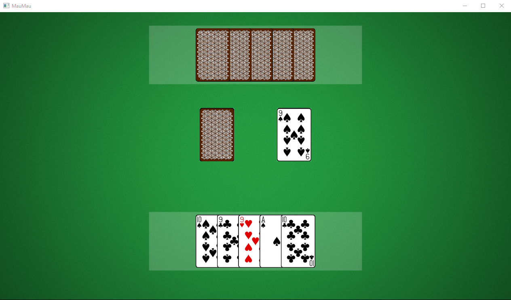

[BGADoc]: https://tudo-aqua.github.io/bgw/kotlin-docs/bgw-core/tools.aqua.bgw.core/-board-game-application/index.html
[BGA#showGameSceneDoc]: https://tudo-aqua.github.io/bgw/kotlin-docs/bgw-core/tools.aqua.bgw.core/-board-game-application/show-game-scene.html
[BGA#showMenuSceneDoc]: https://tudo-aqua.github.io/bgw/kotlin-docs/bgw-core/tools.aqua.bgw.core/-board-game-application/show-menu-scene.html
[BGA#showDoc]: https://tudo-aqua.github.io/bgw/kotlin-docs/bgw-core/tools.aqua.bgw.core/-board-game-application/show.html
[BGSDoc]: https://tudo-aqua.github.io/bgw/kotlin-docs/bgw-core/tools.aqua.bgw.core/-board-game-scene/index.html
[MSDoc]: https://tudo-aqua.github.io/bgw/kotlin-docs/bgw-core/tools.aqua.bgw.core/-menu-scene/index.html
[Scene#addComponents]: https://tudo-aqua.github.io/bgw/kotlin-docs/bgw-core/tools.aqua.bgw.core/-scene/add-components.html
[StaticComponentViewDoc]: https://tudo-aqua.github.io/bgw/kotlin-docs/bgw-core/tools.aqua.bgw.components/-static-component-view/index.html
[LabelDoc]: https://tudo-aqua.github.io/bgw/kotlin-docs/bgw-core/tools.aqua.bgw.components.uicomponents/-label/index.html
[ButtonDoc]: https://tudo-aqua.github.io/bgw/kotlin-docs/bgw-core/tools.aqua.bgw.components.uicomponents/-button/index.html
[GameComponentDoc]:https://tudo-aqua.github.io/bgw/kotlin-docs/bgw-core/tools.aqua.bgw.components.gamecomponentviews/-game-component-view/index.html
[ContainerDoc]:https://tudo-aqua.github.io/bgw/kotlin-docs/bgw-core/tools.aqua.bgw.components.container/-game-component-container/index.html
[CardStackDoc]: https://tudo-aqua.github.io/bgw/kotlin-docs/bgw-core/tools.aqua.bgw.components.container/-card-stack/index.html
[LinearLayoutDoc]: https://tudo-aqua.github.io/bgw/kotlin-docs/bgw-core/tools.aqua.bgw.components.container/-linear-layout/index.html

[visualsTutorial]: https://tudo-aqua.github.io/bgw/concepts/visual/visual.html

# Board Game Work

In this tutorial we want to introduce you to BoardGameWork.
In this section we will discuss the core features and how to set up your first game scene.
Running example will be the first steps in implementing the MauMau card game.

## Setup

Each application starts with a [BoardGameApplication][BGADoc] instance. 
By default, your view controller class should inherit from BoardGameApplication.

````kotlin
class MauMauViewController : BoardGameApplication(windowTitle = "MauMau")
````

This creates a window in which the game can take place.
For the game itself we declare a [BoardGameScene][BGSDoc] and a [MenuScene][MSDoc].

````kotlin
class MauMauViewController : BoardGameApplication(windowTitle = "MauMau") {
    val mauMauMenuScene: MauMauMenuScene = MauMauMenuScene()
    val mauMauGameScene: MauMauGameScene = MauMauGameScene()
}
````
````kotlin
class MauMauGameScene : BoardGameScene(background = ImageVisual("bg.jpg"))
````
````kotlin
class MauMauMenuScene : MenuScene(width = 300, height = 500, background = ColorVisual(Color.WHITE))
````

As you can see the menu scene gets a height of 500px and width of 300px while the game scene gets the default size of FullHD.
The game scene gets an image as background and the menu scene solid white. Read more about visuals [here][visualsTutorial].

## BoardGameScene and MenuScene

In the MauMau example we have declared a game scene and a menu scene. 
In menu scenes you cannot use draggable components, only layouts and ui elements: In other words components that extend [StaticComponentView][StaticComponentViewDoc].

A [BoardGameApplication][BGADoc] can display one [BoardGameScene][BGSDoc] and one [MenuScene][MSDoc] at the same time. 
While the menu scene is shown, the game scene gets blurred out.

The scenes can be shown by calling [showGameScene][BGA#showGameSceneDoc] and [showMenuScene][BGA#showMenuSceneDoc]. <br>
The window gets shown by calling [show][BGA#showDoc].

````kotlin
class MauMauViewController : BoardGameApplication(windowTitle = "MauMau") {	
    val mauMauMenuScene: MauMauMenuScene = MauMauMenuScene()
    val mauMauGameScene: MauMauGameScene = MauMauGameScene()
    
    init {
        showGameScene(mauMauGameScene)
        showMenuScene(mauMauMenuScene)
        show()
    }
}
````

## Declaring a MenuScene

As we have seen, we cann pass the desired size of the scene as an argument to the super constructor.
As with all coordinates these are declared in a virtual coordinate space that will be transformed while rendering.
Primary constraint while choosing the scene size is the ratio of height and width as this is not changed by scaling.
If the ratio does not match the windows size, black bars will appear which can be styled using visuals as well.

All components declared in this scene will relate its position and size to the declared coordinate space.

In this example we want to have a [Label][LabelDoc] displaying *"Main menu"* and three [Buttons][ButtonDoc] displaying *"Continue"*, *"New Game"* and *"Exit"*.
These components get declared and added to the scene by calling [addComponents][Scene#addComponents]

````kotlin
class MauMauMenuScene : MenuScene(width = 300, height = 500, background = ColorVisual(Color.WHITE)) {

    val menuLabel: Label = Label(
        height = 100,
        width = 200,
        posX = 50,
        posY = 0,
        label = "Main menu",
        font = Font(fontWeight = Font.FontWeight.BOLD)
    )
	
    val continueGameButton: Button = Button(
        height = 80,
        width = 200,
        posX = 50,
        posY = 110,
        label = "Continue",
        font = Font(color = Color.WHITE, fontStyle = FontStyle.ITALIC),
        visual = ImageVisual("button_bg.jpg")
    )
    
    val newGameButton: Button = Button(
        height = 80,
        width = 200,
        posX = 50,
        posY = 220,
        label = "New Game",
        font = Font(color = Color.WHITE, fontStyle = FontStyle.ITALIC),
        visual = ImageVisual("button_bg.jpg")
    )
    
    val exitButton: Button = Button(
        height = 80,
        width = 200,
        posX = 50,
        posY = 330,
        label = "Exit",
        font = Font(color = Color.WHITE, fontStyle = FontStyle.ITALIC),
        visual = ImageVisual("button_bg.jpg")
    )
    
    init {
        addComponents(
            menuLabel,
            continueGameButton,
            newGameButton,
            exitButton,
        )
    }
}
````

## Declaring a BoardGameScene

[BoardGameScenes][BGSDoc] are the main component of your game.
BoardGameScenes behave just like menu scenes but can additionally contain [GameComponentViews][GameComponentDoc] and [GameContainerViews][ContainerDoc].

For our MauMau example we need two [CardStacks][CardStackDoc] and two player hands as [LinearLayouts][LinearlayoutDoc].

````kotlin
class MauMauGameScene : BoardGameScene(background = ImageVisual("bg.jpg")) {
	
    val drawStack: CardStack<CardView> = CardStack(
        height = 200,
        width = 130,
        posX = 750,
        posY = 360,
        visual = ColorVisual(255, 255, 255, 50)
    )
    val gameStack: CardStack<CardView> = CardStack(
        height = 200,
        width = 130,
        posX = 1040,
        posY = 360,
        visual = ColorVisual(255, 255, 255, 50)
    )
    
    var currentPlayerHand: LinearLayout<CardView> = LinearLayout(
        height = 220,
        width = 800,
        posX = 560,
        posY = 750,
        spacing = -50,
        alignment = Alignment.CENTER,
        visual = ColorVisual(255, 255, 255, 50)
    )
    
    var otherPlayerHand: LinearLayout<CardView> = LinearLayout<CardView>(
        height = 220, 
        width = 800, 
        posX = 560, 
        posY = 50, 
        spacing = -50, 
        alignment = Alignment.CENTER, 
        visual = ColorVisual(255, 255, 255, 50)
    ).apply { 
        rotation = 180.0 
    }
        
    init {
        addComponents(
            drawStack,
            gameStack,
            currentPlayerHand,
            otherPlayerHand
        )
    }
}
````

## Event handler

When we start the application both menu scene and game scene are shown.


We now want to add event handlers to the menu buttons to start a new game and close the menu scene.
As these button's actions change the scene, the handlers get set in the view controller.

````kotlin
class MauMauViewController : BoardGameApplication(windowTitle = "MauMau") {	
    val mauMauMenuScene: MauMauMenuScene = MauMauMenuScene()
    val mauMauGameScene: MauMauGameScene = MauMauGameScene()
    
    init {
	    registerMenuEvents()
        
        showGameScene(mauMauGameScene)
        showMenuScene(mauMauMenuScene)
        show()
    }
	
    private fun registerMenuEvents() {
        mauMauMenuScene.continueGameButton.onMouseClicked = {
            hideMenuScene()
        }
        
        mauMauMenuScene.newGameButton.onMouseClicked = {
            //Start new game here
            hideMenuScene()
        }
        
        mauMauMenuScene.exitButton.onMouseClicked = {
            exit()
        }
    }
}
````

Now after pressing the *"New Game"* button the menu scene is hidden.


